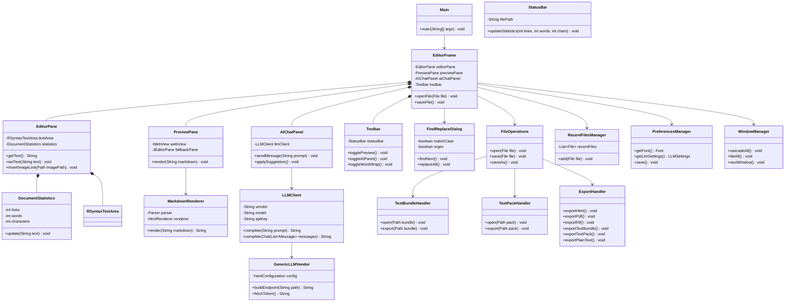

# PurplePlatypus 1.6.0

A lightweight desktop Markdown editor built with Java Swing, featuring a live preview pane that renders your Markdown as you type and an AI writing assistant powered by LLM APIs.

## Features

- **Split-pane editor** — Write Markdown on the left, see the rendered HTML preview on the right, with synchronized scrolling so the preview stays aligned with your position in the editor
- **Live preview** — The preview updates in real time as you type, with no manual refresh needed
- **AI writing assistant** — Built-in chat panel powered by LLM APIs to help draft, edit, and improve your markdown content
- **Multi-vendor LLM support** — Connect to OpenAI, Anthropic, Google, DeepSeek, Alibaba, Cerebras, Groq, Meta, Mistral, Moonshot AI, Perplexity, xAI, or local Ollama models
- **Generic LLM vendor** — YAML-configurable API endpoint for any LLM service (corporate APIs, custom proxies, etc.) with OAuth/IAM token exchange, configurable request/response format, and single-shot or multi-turn conversation modes
- **Multi-window** — Open multiple editor windows with File > New
- **Window management** — Window menu with Minimize, Zoom, Previous/Next window navigation, Cascade All, and Tile All
- **Cross-platform** — Runs on macOS (ARM64), Windows (x64, ARM64), and Linux (x64, ARM64)
- **Native look and feel** — Uses the platform's native UI (Aqua on macOS, Windows 11 on Windows, GTK on Linux)
- **macOS integration** — Menu bar in the system menu bar, About and Preferences in the application menu, native file dialogs, Command key shortcuts
- **Toolbar** — Status bar showing the full file path with document statistics, toggle buttons for word wrap, invisible characters, synchronized scrolling, preview, and AI panels
- **Line numbers** — A line number gutter on the left side of the editor that stays in sync as you scroll and type
- **File operations** — Create new files, open existing `.md`/`.markdown`/`.txt`/`.textbundle`/`.textpack` files, and save your work
- **Recent files** — File > Recents menu shows recently opened documents; selecting one brings its window to front if already open
- **TextBundle support** — Open and export `.textbundle` packages with images in the `assets/` subfolder; `.textbundle` directories appear as selectable files in the Open dialog on all platforms
- **TextPack support** — Open and export `.textpack` files (compressed TextBundle archives); Save is disabled for files opened from a TextPack (use Save As or Export instead)
- **Dirty checking** — Prompts to save unsaved changes when closing a window or quitting the application
- **Undo/Redo** — Full multi-level undo and redo support
- **Clipboard** — Cut, Copy, and Paste via the Edit menu
- **Markdown formatting** — Bold, Italic, Underline, Strikethrough, Superscript, Subscript, Center, and Insert (++underline++) via the Markdown menu (enabled when text is selected)
- **Headings** — Insert Heading 1 through Heading 6 via the Markdown menu (replaces any existing heading prefix)
- **Horizontal Rule** — Insert a `---` separator via the Markdown menu
- **Footnotes** — Insert footnote references and definitions via the Markdown menu
- **Image drag-and-drop** — Drag GIF, JPEG, or PNG files onto the editor to insert markdown image links with relative paths; the caret tracks the pointer for precise placement
- **Links and Images** — Insert or edit markdown links and images via dialogs
- **Tables** — Insert or edit GFM-style markdown tables via a visual dialog
- **Lists** — Convert lines to ordered, unordered, or task lists
- **Block formatting** — Block Quote, Inline Code, Block Code, Inline Math, and Block Math
- **Print** — Page Setup and Print (⌘/Ctrl+P) using the native system print dialog
- **Export** — Export to HTML, PDF, Word Document (DOCX), TextBundle, TextPack, RTF, or Plain Text formats
- **Import** — Import from HTML, Plain Text, RTF, or Word Document files, converting content to Markdown
- **Find** — Search with options for Match Case, Wrap Around, Search Backwards, Find in Selection, and Regular Expression (remembers the original selection for repeated searches)
- **Find All** — Opens a results window showing matching lines with highlighted text; click a match to jump to it in the editor
- **Count** — Quickly count the number of matches in the document or selection
- **Replace** — Find and replace with Replace, Replace and Find, and Replace All operations
- **Escape sequences in Find/Replace** — "Interpret Escapes" option processes `\t`, `\n`, `\r`, `\\`, and `\uXXXX` in find and replace fields
- **Search/Replace recents** — Save frequently used search and replace expressions with +/- buttons; recall them from a dropdown menu
- **Find in Preview** — Search for selected editor text in the rendered preview (⇧⌘F); right-click selected preview text to find it in the source
- **Go to Line** — Jump to a specific line number in the source (⇧⌘J)
- **Line ending conversion** — Detect and convert between Unix (`\n`) and Windows (`\r\n`) line endings via the Edit menu; line ending format is preserved on save
- **Cleanup Pandoc Tables** — Convert grid/Pandoc-style tables to standard GFM pipe tables (also auto-converted in preview)
- **Zap Gremlins** — Configurable substitution of Unicode characters (smart quotes, em-dashes, non-breaking spaces, etc.) with ASCII equivalents; user-editable rules saved to preferences
- **HTML Encode** — Convert non-ASCII characters to HTML entities (named where available per HTML5, otherwise numeric code points)
- **Selection-aware editing** — Cleanup Pandoc Tables, Zap Gremlins, and HTML Encode operate on the selection if text is selected, or the full document otherwise
- **Show invisible characters** — Toggle button in the toolbar to reveal spaces (dots), tabs (arrows), and line endings (paragraph marks)
- **Document statistics** — Live display of line count, word count, and character count in the toolbar, updated as you type
- **External change detection** — Detects when a file is modified on disk by another program and prompts to reload or keep current changes
- **Large file performance** — Preview updates and document statistics are debounced for large files; syntax highlighting is disabled above 1 MB; AI context is truncated above 20K characters

- **Markdown support** — CommonMark with extensions: GFM tables, strikethrough, task lists, autolink, footnotes, heading anchors, image attributes, ins (underline), and YAML front matter
- **Styled preview** — Clean, readable HTML output with custom CSS styling and MathJax support
- **Syntax highlighting** — Code blocks in the preview and AI chat are syntax-highlighted via highlight.js with automatic language detection and light/dark theme support
- **Mermaid diagrams** — Mermaid code blocks are rendered as diagrams in both the preview and AI chat panes
- **Figure captions** — Images with alt text are rendered as `<figure>` elements with a visible `<figcaption>` in the preview
- **Preview fallback** — On platforms where JavaFX WebView is unavailable (e.g. Windows ARM64), the preview gracefully falls back to a Swing-based HTML renderer with reduced functionality
- **Preferences** — Configurable font family and size for editor, preview, and AI chat panes; LLM vendor/model/API key settings; chat bubble colors; toolbar button highlight color
- **Window state persistence** — Window size, divider positions, and panel visibility are remembered between sessions

## AI Assistant

The built-in AI chat panel helps you write and improve markdown content:

- Draft new content (paragraphs, sections, lists, tables)
- Improve existing text (grammar, clarity, tone, structure)
- Add markdown formatting and suggest document organization
- Generate tables from descriptions
- Help with technical writing, blog posts, documentation, and READMEs

When the AI suggests a complete document replacement, you're given Allow/Reject buttons to accept or decline the changes.

The AI chat panel renders responses with full markdown support (tables, code blocks, math, links) via an embedded WebView with MathJax. A copy button on each AI response copies the raw markdown to the clipboard. For large documents, the AI returns efficient unified diffs instead of full replacements, reducing token usage and response time.

Configure your LLM provider in Preferences (vendor, model, and API key). For custom or corporate APIs, select the "Generic" vendor and use "Configure..." to define a YAML configuration with custom endpoints, headers, authentication, and response parsing.

## Generic LLM Vendor

The Generic vendor supports any LLM API through a YAML configuration file (`~/.glowingcat-generic.yml`):

- **Custom endpoints** — Define any REST API URL with variable substitution
- **Flexible authentication** — Bearer tokens, Basic auth, API keys, or OAuth/IAM token exchange
- **Token exchange** — Optional `Auth` section automatically fetches and caches access tokens (supports IBM IAM, OAuth2, etc.)
- **Conversation modes** — Single-shot (with server-side GUID tracking) or multi-turn (full history sent)
- **Response parsing** — JSONPath-like expressions to extract content from any response format
- **Model discovery** — Configurable models endpoint with custom field extraction
- **Variables** — `${AUTH_TOKEN}`, `${MODEL}`, `${PROMPT}`, `${MESSAGES}`, `${MESSAGES_NO_SYSTEM}`, `${SYSTEM_PROMPT}`, `${GUID}`

Sample configurations for Amazon Bedrock, Anthropic, IBM watsonx.ai, Microsoft Azure, and OpenAI are included in the `aichat/src/main/resources/config/` folder.

## Export Formats

- **HTML** — Fully styled HTML with CSS, relative image paths preserved
- **PDF** — Print-to-file via the system's PDF output, with print-friendly links (URLs shown in parentheses)
- **Word Document (DOCX)** — Export to `.docx` with math support (LaTeX converted to OMML) and Mermaid diagrams rendered as PNG images
- **TextBundle** — Standard `.textbundle` package with `text.md`, `info.json`, and images copied into `assets/` (preserving subfolder hierarchy)
- **TextPack** — Compressed `.textpack` file (zipped TextBundle) for easy sharing
- **RTF** — Rich Text Format with headings, bold, italic, strikethrough, code, lists, and block quotes
- **Plain Text** — Export markdown content as plain text with formatting stripped

## Platform Support

| Platform | Preview | Status |
|----------|---------|--------|
| macOS ARM64 | JavaFX WebView | Full support |
| Windows x64 | JavaFX WebView | Full support |
| Windows ARM64 | Swing JEditorPane | Reduced (no MathJax/advanced CSS) |
| Linux x64 | JavaFX WebView | Full support |
| Linux ARM64 | JavaFX WebView | Full support |

## Requirements

- Java 21 or later
- Maven 3.6+

## Building

```bash
mvn compile
```

## Running

```bash
mvn install -q && mvn exec:java -pl app
```

Or run `com.glowingcat.Main` directly from your IDE.

## Tech Stack

- **Java Swing** — GUI framework
- **commonmark-java** — Markdown parsing and HTML rendering (with GFM tables, strikethrough, task lists, autolink, footnotes, heading anchors, image attributes, ins, and YAML front matter extensions)
- **RSyntaxTextArea** — Syntax-aware text editor component
- **JavaFX WebView** — HTML preview rendering with MathJax (with JEditorPane fallback)
- **highlight.js** — Syntax highlighting for code blocks in preview and AI chat
- **Mermaid** — Diagram rendering for flowcharts, sequence diagrams, and more
- **Apache POI** — Word Document (DOCX) export and import
- **SnuggleTeX** — LaTeX to OMML conversion for math in DOCX export
- **Gson** — JSON serialization for user preferences
- **SnakeYAML** — YAML parsing for Generic vendor configuration
- **java.net.http** — HTTP client for LLM API calls

## Class Diagram

A high-level overview of PurplePlatypus's main classes and their relationships:



---

## License

GNU General Public License v3.0 — see [LICENSE](LICENSE) for details.

© 2026 Richard Lesh
