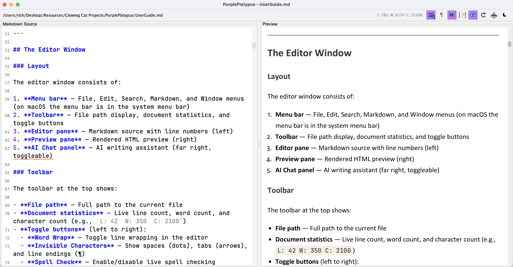
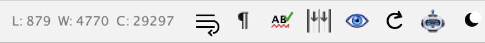
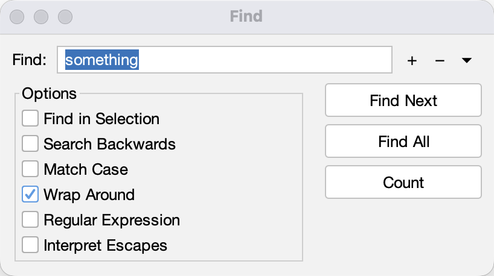
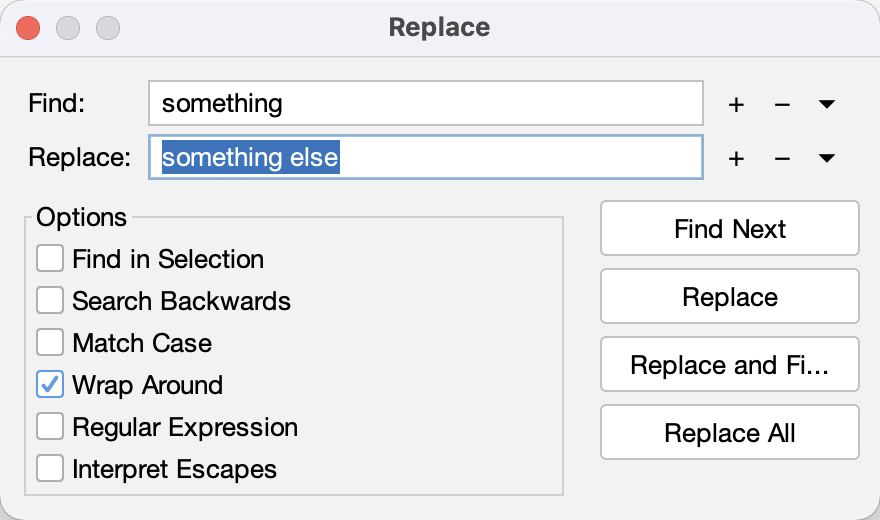
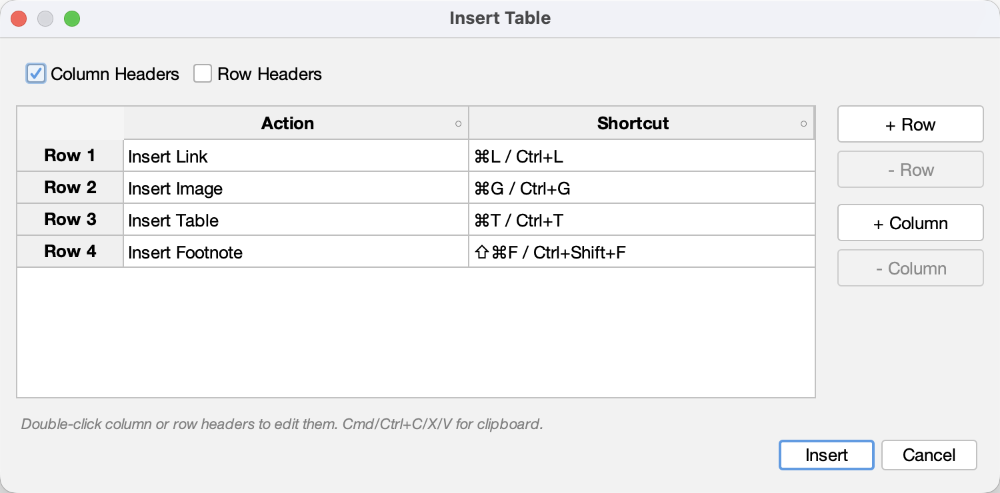
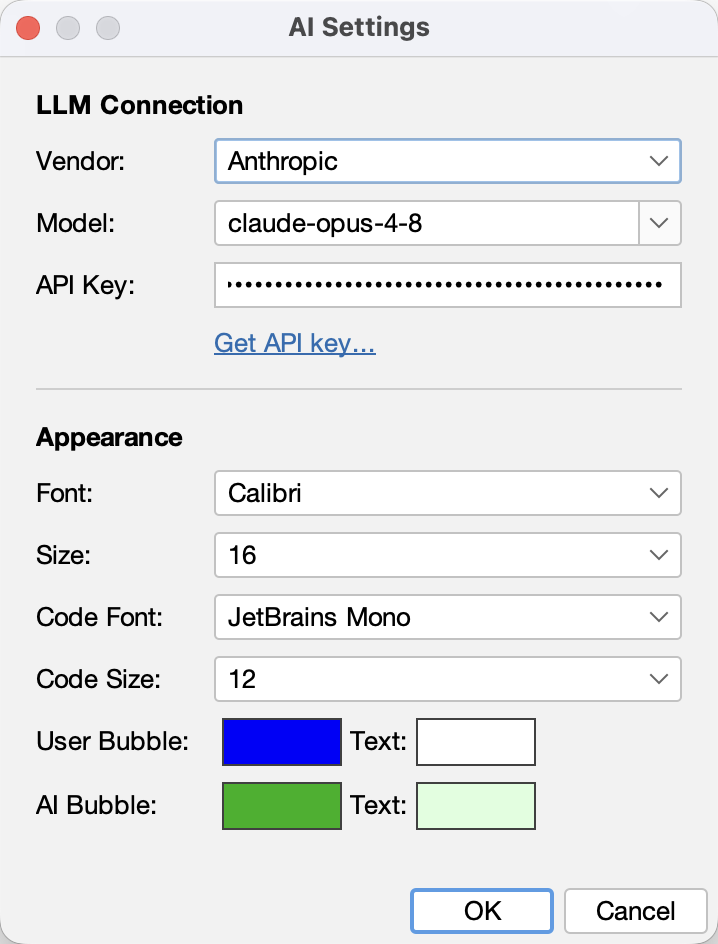
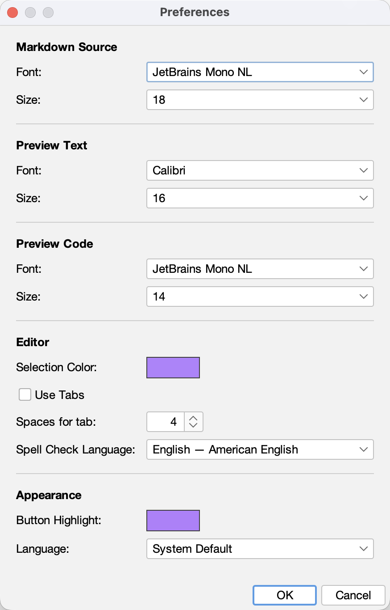
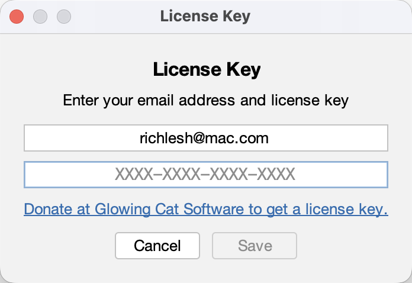

# PurplePlatypus User Guide

**Version 1.9.0**

PurplePlatypus is a lightweight desktop Markdown editor with a live preview pane, an AI writing assistant, and live spell checking. It runs on macOS, Windows, and Linux.

---

## Table of Contents

- [Getting Started](#getting-started)
- [The Editor Window](#the-editor-window)
- [File Menu Items](#file-menu-items)
- [Edit Menu Items](#edit-menu-items)
- [Search Menu Items](#search-menu-items)
- [Markdown Menu Items](#markdown-menu-items)
- [Live Preview](#live-preview)
- [AI Writing Assistant](#ai-writing-assistant)
- [Spell Checking](#spell-checking)
- [Import and Export](#import-and-export)
- [Printing](#printing)
- [Window Management](#window-management)
- [Settings](#settings)
- [Keyboard Shortcuts](#keyboard-shortcuts)
- [File Locations](#file-locations)
- [Platform Support](#platform-support)
- [Supported Languages (UI)](#supported-languages-ui)
- [Troubleshooting](#troubleshooting)
- [License Key](#license-key)
- [License](#license)

---

## Getting Started

When you launch PurplePlatypus, a new editor window opens with a split-pane layout:

- **Left pane** — The Markdown source editor with line numbers
- **Right pane** — A live HTML preview that updates as you type

Start typing Markdown in the editor, and the preview will render it in real time. You can open existing files, create new documents, and use the AI assistant to help with your writing.

### Supported File Formats

PurplePlatypus can open the following file types:

- `.md` — Markdown
- `.markdown` — Markdown (alternate extension)
- `.txt` — Plain text
- `.textbundle` — TextBundle package (Markdown with bundled images)
- `.textpack` — TextPack (compressed TextBundle archive)

---

## The Editor Window

### Layout

The editor window consists of:

1. **Menu bar** — File, Edit, Search, Markdown, and Window menus (on macOS the menu bar is in the system menu bar)
2. **Toolbar** — File path display, document statistics, and toggle buttons
3. **Editor pane** — Markdown source with line numbers (left)
4. **Preview pane** — Rendered HTML preview (right)
5. **AI Chat panel** — AI writing assistant (far right, toggleable)

{width=100%}

### Toolbar

The toolbar at the top shows:

- **File path** — Full path to the current file
- **Document statistics** — Live line count, word count, and character count (e.g., `L: 42  W: 350  C: 2100`)
- **Toggle buttons** (left to right):
  - **Word Wrap** — Toggle line wrapping in the editor
  - **Invisible Characters** — Show spaces (dots), tabs (arrows), and line endings (¶)
  - **Spell Check** — Enable/disable live spell checking
  - **Synchronized Scrolling** — Link editor and preview scroll positions
  - **Preview** — Show/hide the preview pane
  - **Reload** — Force refresh the preview
  - **AI Assistant** — Show/hide the AI chat panel
  - **Dark Mode** — Toggle between light and dark themes
  

{width=100%}

---

## File Menu Items

### Creating and Opening Files

| Action | Shortcut |
|--------|----------|
| New window | ⌘N / Ctrl+N |
| Open file | ⌘O / Ctrl+O |
| Close window | ⌘W / Ctrl+W |

When you open a file, PurplePlatypus detects its line ending format (Unix `\n` or Windows `\r\n`) and preserves it when saving.  

> Note: You may switch the line ending format using the Edit menu item "Convert to Windows/Unix Line Endings"

### Saving Files

| Action | Shortcut |
|--------|----------|
| Save | ⌘S / Ctrl+S |
| Save As | ⇧⌘S / Ctrl+Shift+S |

PurplePlatypus tracks unsaved changes (indicated by a modified window title). If you try to close a window with unsaved changes, you'll be prompted to Save, Don't Save, or Cancel.

> **Note:** Files opened from a TextPack (.textpack) cannot be saved directly back to the archive. Use Save As or Export instead.

### Recent Files

The **File > Recents** menu shows your recently opened documents (up to 20). Selecting a recent file opens it, or brings its window to front if it's already open. You can clear the recents list from this menu.

### External Change Detection

If another program modifies a file you have open, PurplePlatypus will detect the change when the window is activated and prompt you to **Reload** (load the external changes) or **Keep Current** (ignore the external changes).

---

## Edit Menu Items

### Basic Editing

| Action | Shortcut |
|--------|----------|
| Undo | ⌘Z / Ctrl+Z |
| Redo | ⌘Y / Ctrl+Y |
| Cut | ⌘X / Ctrl+X |
| Copy | ⌘C / Ctrl+C |
| Paste | ⌘V / Ctrl+V |

PurplePlatypus supports full multi-level undo and redo.

### Line Ending Conversion

Use **Edit > Convert to Windows/Unix Line Endings** to switch between `\r\n` and `\n` formats. The menu item label changes depending on the current format.

### Convert Pandoc Table

Converts Pandoc grid-style tables to standard GFM (GitHub Flavored Markdown) pipe-style tables. If text is selected, only tables within the selection are converted; otherwise the entire document is processed.

### Format Table

Auto-formats the GFM pipe-style table at the cursor position, padding columns to uniform width while respecting header alignment markers (`:---`, `:---:`, `---:`).

### HTML Encode

Converts non-ASCII characters to HTML entities. Named entities are used where available per the HTML5 standard (e.g., `&mdash;`); otherwise numeric code points are used (e.g., `&#x2603;`). If text is selected, only the selection is processed.

### Zap Gremlins

Opens a dialog to configure Unicode character substitutions. Common replacements include:

- Smart quotes → straight quotes
- Em-dashes → hyphens
- Non-breaking spaces → regular spaces
- Other Unicode characters → ASCII equivalents

Your rules are saved to preferences and remembered between sessions. If text is selected, only the selection is processed.

---

### Image Drag-and-Drop

Drag GIF, JPEG, or PNG files directly onto the editor to insert a Markdown image link with a relative path. The caret follows your mouse pointer so you can place the image precisely where you want it.

---

## Search Menu Items

### Find

Open with **Search > Find** (⌘F / Ctrl+F). 

Options:

- **Find in Selection** — Restrict search to the selected text
- **Search Backwards** — Search toward the beginning of the document
- **Match Case** — Case-sensitive search
- **Wrap Around** — Continue searching from the beginning when reaching the end

- **Regular Expression** — Use regex patterns
- **Interpret Escapes** — Process `\t`, `\n`, `\r`, `\\`, and `\uXXXX` escape sequences

Actions:
- **Find Next** — Finds and highlights the next match in the editor.
- **Find All** — Opens a results window showing all matching lines with highlighted text. Click a match to jump to it in the editor.
- **Count** — Shows the number of matches in the document or selection.

- **Search Save** - Search phrases can be saved using the "+" button next to the search field.  Search phrases can be removed from memory using the "-" button.  Search phrases can be recalled using the "▾" button.

### Replace

Open with **Search > Replace** (⌘R / Ctrl+R). Provides all same options as find plus these new actions:

- **Replace** — Replace the current match
- **Replace and Find** — Replace and advance to the next match
- **Replace All** — Replace all matches at once

### Search/Replace Recents

Use the "+" button to save frequently used search or replace phrases Use the "-" button to remove the current search or replace phrase Use the "▾" button to recall saved phrases

### Find in Preview

Select text in the editor, then use **Search > Find in Preview** (⇧⌘F / Ctrl+Shift+F) to highlight that text in the rendered preview. You can also right-click selected text in the preview to find it in the source.

### Go to Line

Use **Search > Go to Line** (⇧⌘J / Ctrl+Shift+J) to jump to a specific line number.

---

## Markdown Menu Items

The **Markdown** menu provides formatting commands. Inline formatting commands (Bold, Italic, etc.) require text to be selected.

### Inline Formatting

Selecting text, then choosing one of these menu items will format the selected text according to GFM rules.

| Format | Shortcut | Syntax |
|--------|----------|--------|
| Bold | ⌘B / Ctrl+B | `**text**` |
| Italic | ⌘I / Ctrl+I | `*text*` |
| Underline | ⌘U / Ctrl+U | `++text++` |
| Strikethrough | — | `~~text~~` |
| Superscript | — | `text` |
| Subscript | — | `text` |
| Center | ⇧⌘C / Ctrl+Shift+C | `
` |
| Inline Code | ⌘\` / Ctrl+\` | `` `code` `` |
| Inline Math | ⇧⌘M / Ctrl+Shift+M | `$math$` |

### Block Formatting

Selecting text, then choosing one of these menu items will format the selected block of text according to GFM rules.

| Format | Shortcut | Description |
|--------|----------|-------------|
| Block Quote | ⇧⌘B / Ctrl+Shift+B | Prefix lines with `> ` |
| Block Code | ⌥⌘\` / Ctrl+Alt+\` | Wrap in `&#x60;&#x60;&#x60;` fences |
| Block Math | ⇧⌥⌘M / Ctrl+Alt+Shift+M | Wrap in `$$` fences |
| Mermaid | — | Wrap in `&#x60;&#x60;&#x60;mermaid ` fence |

### Headings

Headings can be added or selected text converted to a heading using the six standard heading menu items.

| Heading | Shortcut |
|---------|----------|
| Heading 1 | ⌘1 / Ctrl+1 |
| Heading 2 | ⌘2 / Ctrl+2 |
| Heading 3 | ⌘3 / Ctrl+3 |
| Heading 4 | ⌘4 / Ctrl+4 |
| Heading 5 | ⌘5 / Ctrl+5 |
| Heading 6 | ⌘6 / Ctrl+6 |

Heading commands replace any existing heading prefix on the current line.

### Horizontal Rule

The Horizontal Rule menu item inserts a horizontal rule at the current cursor position.

| Action | Shortcut |
|--------|----------|
| Insert `---` | ⌘- / Ctrl+- |

### Lists

These commands convert the selected lines (or the current line) into the specified list format.

| List Type | Shortcut |
|-----------|----------|
| Ordered List | ⇧⌘O / Ctrl+Shift+O |
| Unordered List | ⇧⌘U / Ctrl+Shift+U |
| Task List | ⇧⌘T / Ctrl+Shift+T |

### Links, Images, and Tables

Each command opens a dialog for entering the details of the item.

| Action          | Shortcut           |
| --------------- | ------------------ |
| Insert Link     | ⌘L / Ctrl+L        |
| Insert Image    | ⌘G / Ctrl+G        |
| Insert Table    | ⌘T / Ctrl+T        |
| Insert Footnote | ⇧⌥⌘F / Ctrl+Alt+Shift+F |

#### Table Dialog

The table dialog provides a spreadsheet-like interface for creating and editing GFM pipe-style tables:

- Double-click column or row headers to rename them.
- Use ⌘/Ctrl+C, X, V for clipboard operations within the table.
- Choose column alignment (None, Left, Center, Right) using the small icon button in the far right of each header cell.
- Add or remove rows and columns identified by selecting a cell using the "+" and "-" buttons.

---

## Live Preview

The preview pane renders your Markdown as HTML in real time with these features:

### Markdown Extensions

PurplePlatypus uses CommonMark with the following extensions:

- GFM tables (pipe-style)
- Strikethrough (`~~text~~`)
- Task lists (`- [ ]` and `- [x]`)
- Autolinks
- Footnotes
- Heading anchors
- Image attributes
- Insert/underline (`++text++`)
- YAML front matter

### Rendered Features

- **MathJax** — Inline (`$...$`) and block (`$$...$$`) math expressions are rendered with MathJax.
- **Mermaid diagrams** — Code blocks with the `mermaid` language tag are rendered as diagrams (flowcharts, sequence diagrams, etc.).
- **Syntax highlighting** — Code blocks are syntax-highlighted via highlight.js with automatic language detection.
- **Figure captions** — Images with alt text are rendered as `<figure>` elements with visible captions.
- **Lightbox viewer** — Right-click an image in the preview to open it in a zoomable lightbox.

### Synchronized Scrolling

When enabled (via the toolbar toggle), the preview scrolls to match your position in the editor, keeping your current section visible in both panes.

### Performance

For large files, preview updates are debounced (500ms delay after you stop typing) to maintain editor responsiveness. Syntax highlighting in the editor is disabled for files over 1 MB.

---

## AI Writing Assistant

The AI chat panel provides an LLM-powered writing assistant directly in the editor.

### Using the AI Assistant

1. Toggle the AI panel using the **AI** toolbar button.
2. Type a request in the input area at the bottom of the panel.
3. Press Enter or click Send.

The AI has access to your current document and can help with:

- Drafting new content (paragraphs, sections, lists, tables)
- Improving existing text (grammar, clarity, tone, structure)
- Adding markdown formatting and suggesting document organization
- Generating tables from descriptions
- Technical writing, blog posts, documentation, and READMEs

### Document Changes

When the AI suggests changes to your document, you'll see **Allow** and **Reject** buttons:

- **Allow** — Applies the changes to your document
- **Reject** — Discards the suggestion

For large documents, the AI uses efficient unified diffs instead of full replacements, reducing token usage and response time.

### AI Chat Features

- Full Markdown rendering in responses (tables, code blocks, math, links)
- Syntax-highlighted code blocks
- Mermaid diagram rendering
- Copy button on each response to copy raw Markdown to clipboard
- Light and dark theme support

### Configuration

Configure the AI assistant using the **AI Settings** menu item (found in the Edit menu on macOS, or the PurplePlatypus menu on other platforms):

- **Vendor** — Choose your LLM provider
- **Model** — Select the model to use (models are automaticallyl fetched if a valid API key is entered)
- **API Key** — Enter your API key.  Click the "Get API Key..." link to be directed to the vendor's website to apply for an API key.
- **Endpoint** — (For Generic OpenAI API vendor) Enter a custom endpoint URL
- **Font** — Customize the AI chat panel font family and size
- **Code Font** — Customize the font for code blocks in AI responses
- **Chat Colors** — Customize the background and text colors for user and AI bubbles

### Supported LLM Vendors

| Vendor | Client Type |
|--------|-------------|
| Alibaba | OpenAI-compatible |
| Amazon Bedrock | OpenAI-compatible |
| Anthropic | Native Anthropic |
| Cerebras | OpenAI-compatible |
| DeepSeek | OpenAI-compatible |
| Generic | YAML-configured |
| Generic OpenAI API | OpenAI-compatible (custom endpoint) |
| Google | OpenAI-compatible |
| Groq | OpenAI-compatible |
| IBM watsonx | OpenAI-compatible |
| Meta | OpenAI-compatible |
| Microsoft Azure | OpenAI-compatible |
| Mistral | OpenAI-compatible |
| Moonshot AI | OpenAI-compatible |
| Ollama (local) | OpenAI-compatible |
| OpenAI | OpenAI-compatible |
| Perplexity | OpenAI-compatible |
| xAI | OpenAI-compatible |

### Generic LLM Vendor

For custom or corporate APIs, select the **Generic** vendor and use **Configure...** to define a YAML configuration file (`~/.glowingcat-generic.yml`).

The Generic vendor supports:

- **Custom endpoints** — Any REST API URL with variable substitution
- **Authentication** — Bearer tokens, Basic auth, API keys, or OAuth/IAM token exchange
- **Token exchange** — Automatic access token fetching and caching (supports IBM IAM, OAuth2, etc.)
- **Conversation modes** — Single-shot (server-side history) or multi-turn (full history sent)
- **Response parsing** — JSONPath-like expressions to extract content from any response format
- **Model discovery** — Configurable models endpoint
- **Custom TLS certificates** — TrustStore configuration for corporate proxy/self-signed certificates

#### Configuration Variables

| Variable | Description |
|----------|-------------|
| `${AUTH_TOKEN}` | API key from Preferences (or exchanged token) |
| `${MODEL}` | Selected model name |
| `${PROMPT}` | Current user message (JSON-escaped) |
| `${MESSAGES}` | Full conversation history as JSON array |
| `${MESSAGES_NO_SYSTEM}` | Conversation history excluding system messages |
| `${SYSTEM_PROMPT}` | System prompt content (JSON-escaped) |
| `${GUID}` | Conversation GUID (regenerated on Clear) |

Sample configurations for Amazon Bedrock, Anthropic, IBM watsonx.ai, Microsoft Azure, and OpenAI are included with the application.

### Document Size Limits

For very large documents (over 20,000 characters), the AI receives a truncated version centered around the editor caret position. A notification appears when this occurs.

---

## Spell Checking

PurplePlatypus includes live spell and grammar checking powered by LanguageTool.

### Enabling Spell Check

Toggle spell checking using the **Spell Check** button in the toolbar. When enabled:

- Spelling and grammar errors are highlighted with colored squiggly underlines in the editor.
- Right-click an error to see suggestions and corrections.
- The check runs automatically after a short delay (500ms) when you stop typing.

### Markdown-Aware Filtering

The spell checker skips Markdown syntax elements so you won't get false positives on:

- Code blocks and inline code
- URLs and links
- Image references
- YAML front matter
- HTML tags

### Language Support

PurplePlatypus supports **31 spell-check languages**. English is bundled; all other languages are downloaded on demand from Maven Central the first time you select them.

Available languages:

| Code | Language | Code | Language |
|------|----------|------|----------|
| ar | Arabic | km | Khmer |
| ast | Asturian | nl | Dutch |
| be | Belarusian | fa | Persian |
| br | Breton | pl | Polish |
| ca | Catalan | pt | Portuguese |
| crh | Crimean Tatar | ro | Romanian |
| da | Danish | ru | Russian |
| de | German | sk | Slovak |
| el | Greek | sl | Slovenian |
| en | English (American) | sv | Swedish |
| eo | Esperanto | ta | Tamil |
| es | Spanish | tl | Tagalog |
| fr | French | uk | Ukrainian |
| ga | Irish | zh | Chinese |
| gl | Galician | | |
| it | Italian | | |
| ja | Japanese | | |

Change the spell-check language in **Settings > Spell Check Language**.

### User Dictionary

Right-click a highlighted word and choose "Add to Dictionary" to add it to your personal dictionary. User dictionary entries are stored in `~/.purpleplatypus/user-dictionary.txt`.

---

## Import and Export

### Import

Import files into the editor by converting them to Markdown:

| Format | Menu Item |
|--------|-----------|
| HTML | File > Import > HTML |
| Plain Text | File > Import > Plain Text |
| RTF | File > Import > RTF |
| Word Document (.docx) | File > Import > Word Document |

### Export

Export your Markdown to various formats:

| Format | Shortcut | Description |
|--------|----------|-------------|
| HTML | ⌥⌘L / Ctrl+Alt+L | Fully styled HTML with CSS |
| PDF | ⌥⌘P / Ctrl+Alt+P | Print-quality PDF (URLs shown in parentheses) |
| TextBundle | ⌥⌘B / Ctrl+Alt+B | .textbundle package with images in assets/ |
| TextPack | ⌥⌘Z / Ctrl+Alt+Z | Compressed .textpack (zipped TextBundle) |
| RTF | ⌥⌘R / Ctrl+Alt+R | Rich Text with headings, bold, italic, lists |
| Word Document | ⌥⌘W / Ctrl+Alt+W | .docx with math (LaTeX→OMML) and Mermaid diagrams as PNG |
| Plain Text | ⌥⌘T / Ctrl+Alt+T | Formatting stripped |

### TextBundle and TextPack

**TextBundle** is a standard package format that bundles your Markdown file with its images:

- The Markdown content is stored as `text.md`
- Images are copied into an `assets/` subfolder (preserving any subfolder hierarchy)
- An `info.json` metadata file is included

**TextPack** is a compressed (zipped) TextBundle for easy sharing. Files opened from a TextPack cannot be saved directly back; use Save As or Export instead.

---

## Printing

| Action | Shortcut |
|--------|----------|
| Page Setup | — |
| Print | ⌘P / Ctrl+P |

Printing uses the native system print dialog. In the PDF output, links include the URL in parentheses for readability in print.

---

## Window Management

### Multi-Window

PurplePlatypus supports multiple editor windows. Each **File > New** (⌘N) opens a new window. The application exits when the last window is closed.

### Window Menu Items

| Action | Shortcut |
|--------|----------|
| Minimize | ⌘M / Ctrl+M |
| Zoom | — |
| Previous Window | ⇧⌘, / Ctrl+Shift+, |
| Next Window | ⇧⌘. / Ctrl+Shift+. |
| Cascade All | — |
| Tile All | — |

The Window menu also lists all open windows; select one to bring it to the front.

---

## Settings

Open Settings from:
- **macOS:** PurplePlatypus menu > Settings
- **Windows/Linux:** PurplePlatypus menu > Settings

### Fonts

| Setting | Default |
|---------|---------|
| Markdown Source font | Monospaced, 14pt |
| Preview Text font | SansSerif, 14pt |
| Preview Code font | Monospaced, 13pt |

### Editor

| Setting | Default |
|---------|---------|
| Selection Color | #B482FF (purple) |
| Use Tabs | Off (spaces) |
| Spaces for Tab | 4 |
| Spell Check Language | English |

### Appearance

| Setting | Default |
|---------|---------|
| Button Highlight Color | #B482FF (purple) |
| Language | System default |

### Window State

PurplePlatypus automatically saves and restores:

- Window size and position
- Split pane divider positions
- Preview pane visibility
- AI panel visibility
- Dark mode state

---

## Keyboard Shortcuts

> On macOS, ⌘ is the Command key. On Windows and Linux, use Ctrl instead. ⇧ = Shift, ⌥ = Alt/Option.

### File

| Action | macOS | Windows/Linux |
|--------|-------|---------------|
| New | ⌘N | Ctrl+N |
| Open | ⌘O | Ctrl+O |
| Close | ⌘W | Ctrl+W |
| Save | ⌘S | Ctrl+S |
| Save As | ⇧⌘S | Ctrl+Shift+S |
| Print | ⌘P | Ctrl+P |
| Quit | ⌘Q | Ctrl+Q |

### Edit

| Action | macOS | Windows/Linux |
|--------|-------|---------------|
| Undo | ⌘Z | Ctrl+Z |
| Redo | ⌘Y | Ctrl+Y |
| Cut | ⌘X | Ctrl+X |
| Copy | ⌘C | Ctrl+C |
| Paste | ⌘V | Ctrl+V |

### Search

| Action | macOS | Windows/Linux |
|--------|-------|---------------|
| Find | ⌘F | Ctrl+F |
| Replace | ⌘R | Ctrl+R |
| Find in Preview | ⇧⌘F | Ctrl+Shift+F |
| Go to Line | ⇧⌘J | Ctrl+Shift+J |

### Markdown Formatting

| Action | macOS | Windows/Linux |
|--------|-------|---------------|
| Bold | ⌘B | Ctrl+B |
| Italic | ⌘I | Ctrl+I |
| Underline | ⌘U | Ctrl+U |
| Center | ⇧⌘C | Ctrl+Shift+C |
| Link | ⌘L | Ctrl+L |
| Image | ⌘G | Ctrl+G |
| Table | ⌘T | Ctrl+T |
| Footnote | ⇧⌥⌘F | Ctrl+Alt+Shift+F |
| Inline Code | ⌘\` | Ctrl+\` |
| Block Code | ⌥⌘\` | Ctrl+Alt+\` |
| Inline Math | ⇧⌘M | Ctrl+Shift+M |
| Block Math | ⇧⌥⌘M | Ctrl+Alt+Shift+M |
| Block Quote | ⇧⌘B | Ctrl+Shift+B |
| Ordered List | ⇧⌘O | Ctrl+Shift+O |
| Unordered List | ⇧⌘U | Ctrl+Shift+U |
| Task List | ⇧⌘T | Ctrl+Shift+T |
| Heading 1–6 | ⌘1–⌘6 | Ctrl+1–Ctrl+6 |
| Horizontal Rule | ⌘- | Ctrl+- |

### Export

| Action | macOS | Windows/Linux |
|--------|-------|---------------|
| Export HTML | ⌥⌘L | Ctrl+Alt+L |
| Export PDF | ⌥⌘P | Ctrl+Alt+P |
| Export TextBundle | ⌥⌘B | Ctrl+Alt+B |
| Export TextPack | ⌥⌘Z | Ctrl+Alt+Z |
| Export RTF | ⌥⌘R | Ctrl+Alt+R |
| Export Word | ⌥⌘W | Ctrl+Alt+W |
| Export Plain Text | ⌥⌘T | Ctrl+Alt+T |

### Window

| Action | macOS | Windows/Linux |
|--------|-------|---------------|
| Minimize | ⌘M | Ctrl+M |
| Previous Window | ⇧⌘, | Ctrl+Shift+, |
| Next Window | ⇧⌘. | Ctrl+Shift+. |

---

## File Locations

| File | Location | Purpose |
|------|----------|---------|
| App preferences | `~/.purpleplatypus-settings.json` | Editor settings, fonts, appearance, window state, recent files |
| AI settings | `~/.glowingcat-ai-settings.json` | LLM vendor, model, API key, AI fonts, chat colors |
| Generic vendor config | `~/.glowingcat-generic.yml` | Custom LLM API configuration |
| User dictionary | `~/.purpleplatypus/user-dictionary.txt` | Custom words added to spell checker |
| Language packs | `~/.purpleplatypus/languages/` | Downloaded LanguageTool language JARs |

---

## Platform Support

| Platform | Preview Engine | Status |
|----------|----------------|--------|
| macOS ARM64 | JavaFX WebView | Full support |
| Windows x64 | JavaFX WebView | Full support |
| Windows ARM64 | Swing JEditorPane | Reduced (no MathJax/Mermaid/advanced CSS) |
| Linux x64 | JavaFX WebView | Full support |
| Linux ARM64 | JavaFX WebView | Full support |

### Platform-Specific Notes

**macOS:**
- Menu bar is displayed in the system menu bar
- About, Settings, and Quit are in the application menu
- Native file dialogs
- Command (⌘) key shortcuts

**Windows:**
- Native Windows look and feel
- Application menu contains About, Settings, AI Settings, License Key, and Quit

**Linux:**
- GTK look and feel
- Same menu structure as Windows

### Preview Fallback

On platforms where JavaFX WebView is unavailable (e.g., Windows ARM64), the preview gracefully falls back to a Swing-based HTML renderer. This provides basic rendering but without MathJax, Mermaid diagrams, or advanced CSS styling.

---

## Supported Languages (UI)

PurplePlatypus's user interface is localized in 7 languages:

| Code | Language |
|------|----------|
| en | English (default) |
| es | Spanish (Español) |
| fr | French (Français) |
| de | German (Deutsch) |
| it | Italian (Italiano) |
| ja | Japanese (日本語) |
| zh | Simplified Chinese (中文) |

Change the UI language in **Preferences > Language**. A restart is required for the change to take effect.

---

## Troubleshooting

### Large File Performance

- For files over 1 MB, syntax highlighting is automatically disabled in the editor for performance
- Preview updates are debounced so that the editor remains responsive
- A warning dialog appears when opening very large files

### AI Context Truncation

For documents over 20,000 characters, the AI assistant receives a truncated portion of your document centered around your cursor position. A notification informs you when this occurs.

### Spell Check Language Download

When switching to a new spell-check language, PurplePlatypus downloads the required LanguageTool language pack from Maven Central. This requires an internet connection and may take a moment. Once downloaded, language packs are cached locally in `~/.purpleplatypus/languages/` and won't need to be downloaded again.

### Preview Not Rendering

If the preview pane is blank or not updating:

1. Click the **Reload** button in the toolbar
2. Check that the Preview toggle is enabled
3. On Windows ARM64, the preview uses a simplified renderer — some features like MathJax and Mermaid won't be available

### Resetting Preferences

To reset all preferences to defaults, delete the settings files:

- `~/.purpleplatypus-settings.json` (app preferences)
- `~/.glowingcat-ai-settings.json` (AI settings)

---

### Feature Requests and Bug Reporting

You may report issues and request new features using our [GitHub issue tracker](https://github.com/richlesh/PurplePlatypus/issues).

---
## License Key

PurplePlatypus is free and open source software, but a license key helps support its continued development. Entering a key unlocks the ability to remove the registration reminder and shows your support for the project.

### Entering Your License Key

1. Open the **License Key** dialog:
   - **macOS:** File menu > License Key
   - **Windows/Linux:** Application menu > License Key
2. Paste the email that you used to purchase the license key and the 16 character license key into the fields of the dialog.
3. If the email and license key are valid, the  **Save** button will activate.  Click it to save your license key in your settings file.

Once activated, your license key is stored locally and remembered between sessions. If activation fails, double-check that the key was copied in full with no extra spaces.

### Why Support Open Source?

PurplePlatypus is released under the GNU General Public License v3.0, which means it is free to use, study, modify, and share. Open source software like this is often maintained by small teams or individuals who rely on community support to keep improving it.

Purchasing a license key — even though the software is free — directly funds:

- **Ongoing development** — New features, platform support, and Markdown enhancements
- **Bug fixes and maintenance** — Keeping the app stable across macOS, Windows, and Linux
- **Long-term sustainability** — Ensuring the project remains actively maintained

If PurplePlatypus is useful to you, considering a license purchase is a meaningful way to help sustain the open source ecosystem.

---

## License

PurplePlatypus is © 2025–2026 Glowing Cat Software, released under the GNU General Public License v3.0.
