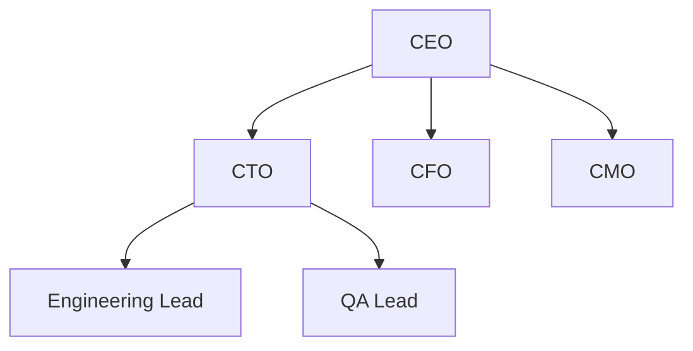
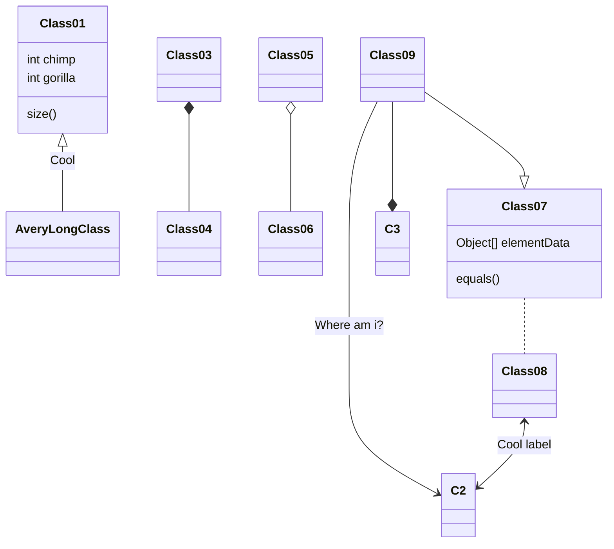
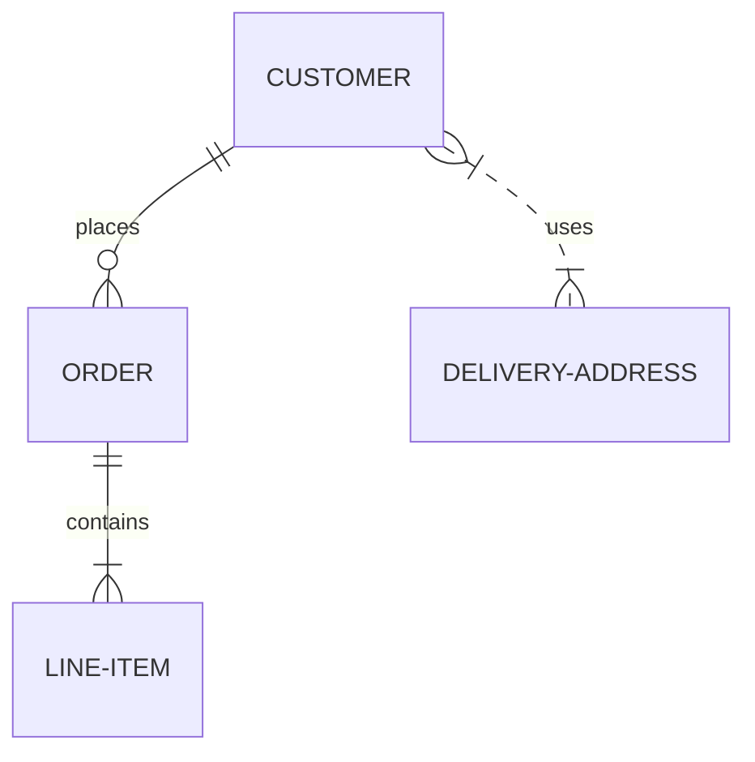

# Markdown Feature Demo

Welcome to a comprehensive demonstration of **Markdown** features supported by PurplePlatypus.

---

## 1. Headings

# H1 Heading
## H2 Heading
### H3 Heading
#### H4 Heading
##### H5 Heading
###### H6 Heading

---

## 2. Text Formatting

- **Bold text** using double asterisks
- *Italic text* using single asterisks
- ***Bold and italic*** combined
- ~~Strikethrough text~~ using tildes
- ++Underlined text++ using double plus
- `Inline code` using backticks
- Regular text with a line break

---

## 3. Lists

### Unordered List

- First item
- Second item
  - Nested item
  - Another nested item
    - Deeply nested item
- Third item

### Ordered List

1. First step
2. Second step
   1. Sub-step A
   2. Sub-step B
3. Third step

### Task List

- [x] Write the introduction
- [x] Add examples
- [ ] Review the document
- [ ] Publish it

---

## 4. Links and Images

Visit [PurplePlatypus on GitHub](https://github.com/richlesh/PurplePlatypus) for more info.

You can also use reference-style links like [this one](#6-code-blocks) to headings.

You can also use reference-style links like [this one](#my-target) to arbitrary named anchor using HTML.


<a id="my-target"></a>https://glowingcat.com "Example Website"

---

## 5. Blockquotes

> This is a blockquote.
>
> It can span multiple lines and paragraphs.
>
> > Nested blockquotes are also supported.
>
> — *Someone Famous*

---

## 6. Code Blocks

Inline: use `printf()` to output text.

### Fenced code block with syntax highlighting

```python
def greet(name):
    """Say hello to someone."""
    print(f"Hello, {name}!")
```

---

## 7. Tables

| Feature        | Supported | Notes                       |
|----------------|:---------:|-----------------------------|
| Headings       | ✅        | Six levels (H1–H6)          |
| Bold / Italic  | ✅        | Standard markdown syntax    |
| Tables         | ✅        | GitHub Flavored Markdown    |
| Math           | ✅        | Inline and block            |
| Task lists     | ✅        | Interactive checkboxes      |

Aligned columns

| Left Aligned | Center Aligned | Right Aligned |
| :----------- | :------------: | ------------: |
| Apples       |      Red       |          1.50 |
| Bananas      |     Yellow     |          0.75 |
| Cherries     |      Dark      |          3.20 |

Cells can also contain **formatting**, `code`, and [links](https://glowingcat.com):

| Feature    | Syntax           | Example                    |
| ---------- | ---------------- | -------------------------- |
| Bold       | `**text**`       | **text**                   |
| Italic     | `*text*`         | *text*                     |
| Code       | `` `code` ``     | `code`                     |
| Link       | `[label](url)`   | [label](https://glowingcat.com) |

---

## 8. Images

<div style="text-align: center;">


</div>

<div style="text-align: center;">

Image Style Attributes

</div>

{width=25%}


{width=100}

---

## 9. Math Notation (LaTeX)

You can write inline math using single dollar signs, like $E = mc^2$ or the golden ratio $\varphi = \frac{1 + \sqrt{5}}{2}$.

For larger expressions, use block math with double dollar signs:

$$
\int_{a}^{b} f(x)\,dx = F(b) - F(a)
$$

### Common Examples

The quadratic formula:

$$
x = \frac{-b \pm \sqrt{b^2 - 4ac}}{2a}
$$

Euler's identity:

$$
e^{i\pi} + 1 = 0
$$

A summation:

$$
\sum_{n=1}^{\infty} \frac{1}{n^2} = \frac{\pi^2}{6}
$$

Greek letters and subscripts can be mixed inline too, such as $\alpha_1, \beta_2, \gamma_3$ or a limit $\lim_{x \to 0} \frac{\sin x}{x} = 1$.

---

## 10. Footnotes

This is a line with a footnote[^1]

[^1]: Here is the footnote.

---

## 11. Mermaid Charts and Diagrams

Support for Mermaid Charts and Diagrams using a simple Markdown format.

<div style="text-align: center;">



</div>



<div style="text-align: center;">



</div>

For more information, see the [Mermaid syntax documentation](https://mermaid.js.org/intro/syntax-reference.html).

---

## 11. Horizontal Rules

Use three or more dashes, asterisks, or underscores:

---

## 12. Escaping Characters

Use a backslash to escape special characters: \*, \`, \#.

---

## 13. HTML in Markdown

You can embed <u>HTML tags</u> directly, like <sub>subscript</sub> and <sup>superscript</sup>

## 14. Export Formats

PurplePlatypus lets you export your document to several formats, so you can
share your work wherever it needs to go.

| Format       | Extension | Best For                                      |
|:------------|:---------|:--------------------- |
| **HTML**     | `.html`   | Publishing to the web or viewing in a browser |
| **PDF**      | `.pdf`    | Printing and sharing polished documents       |
| **Markdown** | `.md`     | Keeping the raw source, portable and editable |
| **RTF** | `.rtf` | Rich Text Format |
| **Plain Text** | `.txt` | Plain Text Format (loses formatting) |
| **TextBundle** | `.textbundle` | Bundle/Folder of Markdown file and images |
| **TextPack** | `.textpack` | ZIP file of Markdown file and images |

### HTML

Exports a fully rendered web page with all formatting, tables, images, and
math preserved. Ideal for embedding in websites or sharing a link.

### PDF

Produces a print-ready document with consistent page layout. Great for
reports, documentation, and anything you plan to hand off or archive.

### Markdown

Saves the plain-text source exactly as written. This keeps your document
lightweight, version-control friendly, and editable in any text editor.

### TextBundle

TextBundle is an open format that packages your Markdown text **and its
referenced assets** — images, attachments, and other media — into a single
bundle. Instead of scattering image files across folders and worrying about
broken links, everything travels together as one self-contained unit.

This makes TextBundle ideal for moving documents between apps and devices
without losing images along the way. A `.textbundle` is technically a folder
(shown as a single file on macOS) containing the Markdown source alongside an
`assets` directory, while the `.textpack` variant zips it all into one
compressed file for easy sharing. Because the format is open and widely
supported by Markdown editors, your content stays portable and future-proof.

### RTF

Rich Text Format (RTF) exports your document as styled text that opens
cleanly in word processors like Microsoft Word, LibreOffice, and Apple
Pages — and pastes nicely into emails and other rich-text fields.

> **Note:** RTF is a simpler format than HTML or PDF, so **not all Markdown
> features are supported**. Core styling like headings, bold, italic, lists,
> and basic tables carries over well, but advanced elements — such as math
> notation, task-list checkboxes, footnotes, and syntax-highlighted code
> blocks — may be simplified or dropped during export. For documents that rely
> on those features, HTML or PDF will preserve them more faithfully.
