Below are minimal, working examples of **every** currently‑supported Mermaid 11.16 diagram type.  
Copy any block into a Mermaid‑enabled viewer (e.g., Markdown preview, MkDocs, Notion, GitHub, etc.) to see the rendered diagram.

---

## 1. Graph (`graph`)
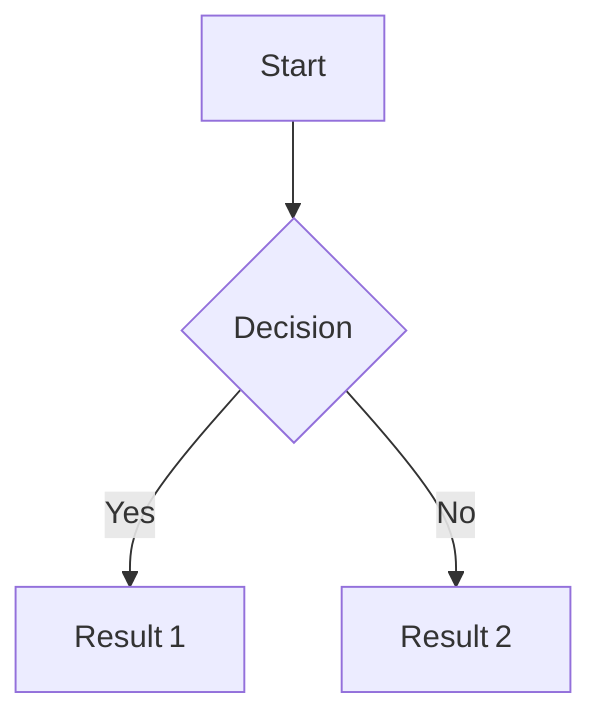

---

## 2. Flowchart (`flowchart`)
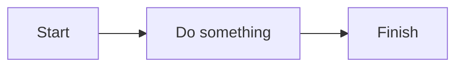

---

## 3. Sequence Diagram (`sequenceDiagram`)
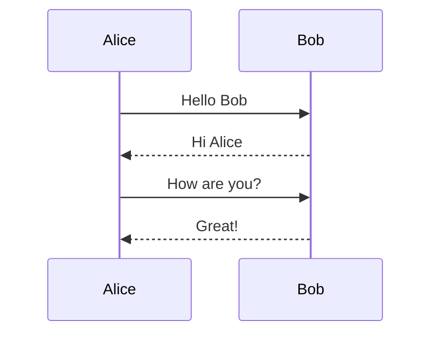

---

## 4. Class Diagram (`classDiagram`)
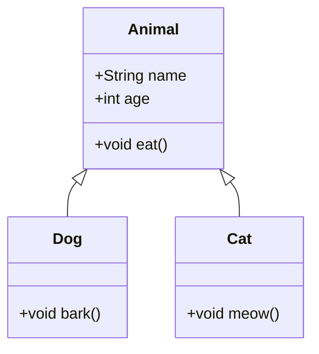

---

## 5. State Diagram v2 (`stateDiagram-v2`)
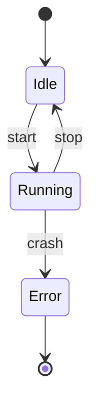

---

## 6. ER Diagram (`erDiagram`)
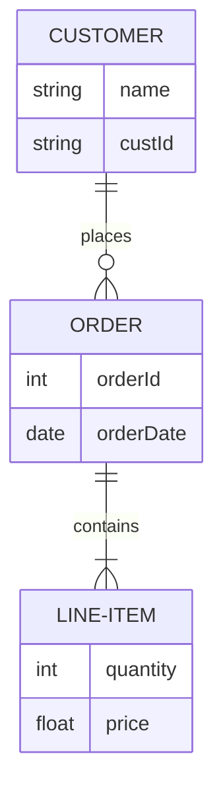

---

## 7. Gantt (`gantt`)
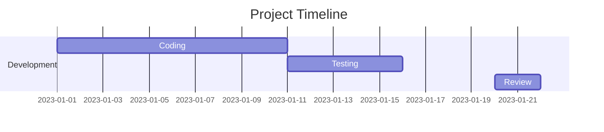

---

## 8. Pie (`pie`)
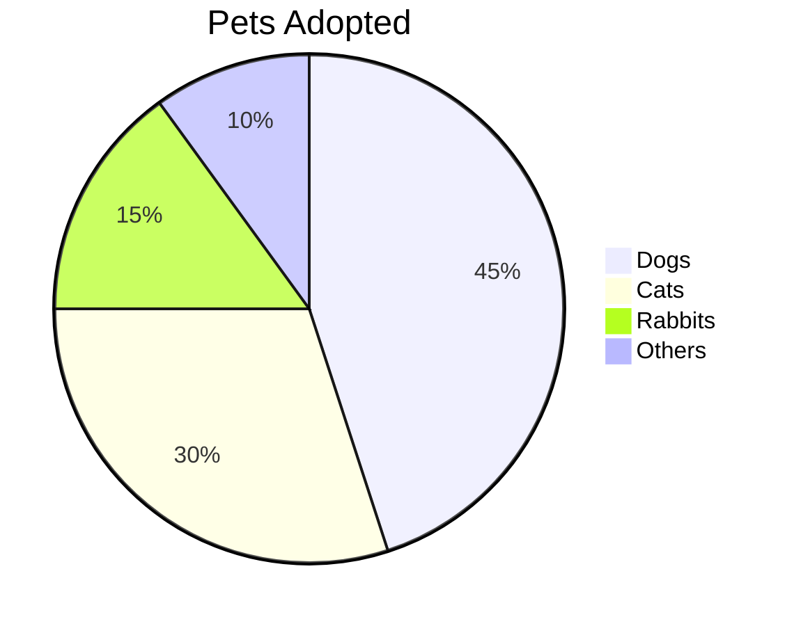
---

## 9. Mindmap (`mindmap`)
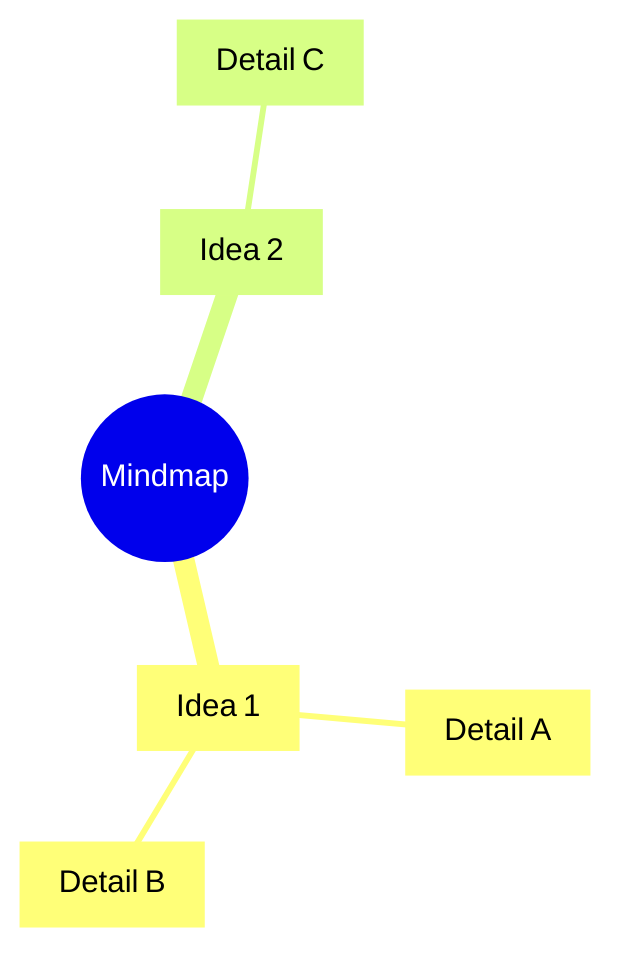

---

## 10. Timeline (`timeline`)
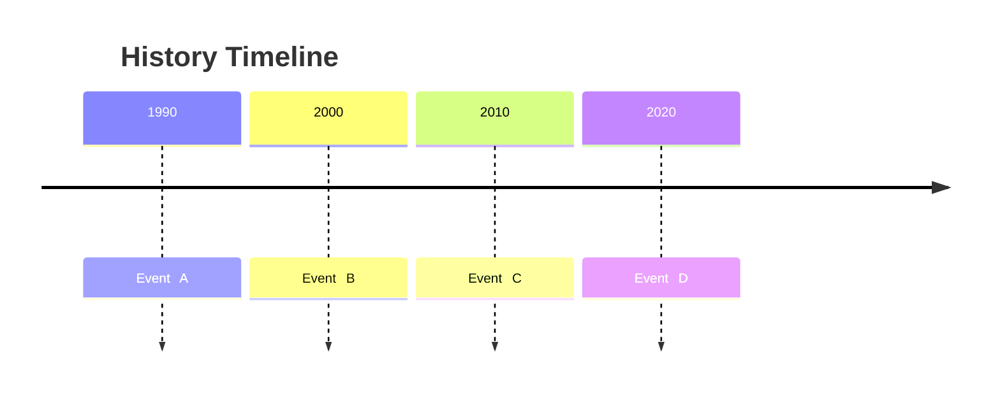

---

## 11. GitGraph (`gitGraph`)
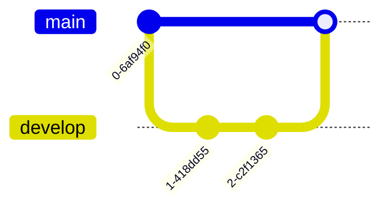

---

## 12. Quadrant Chart (`quadrantChart`)
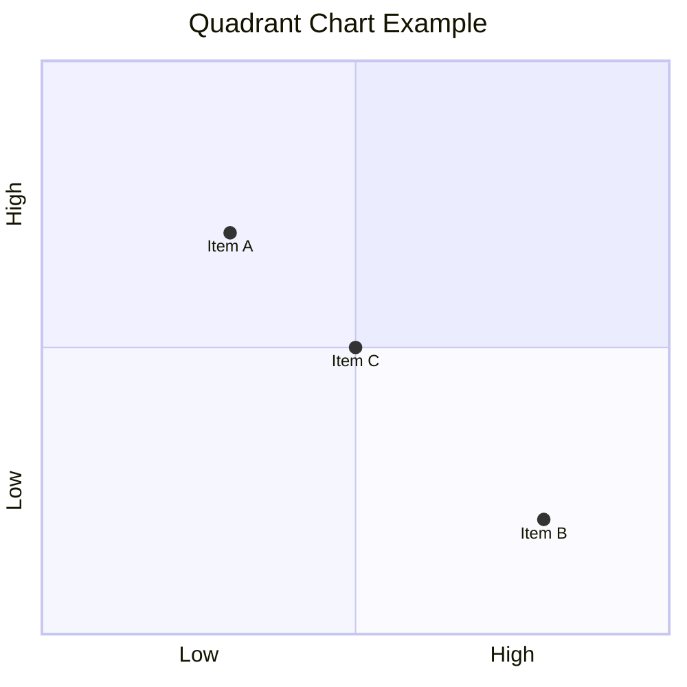

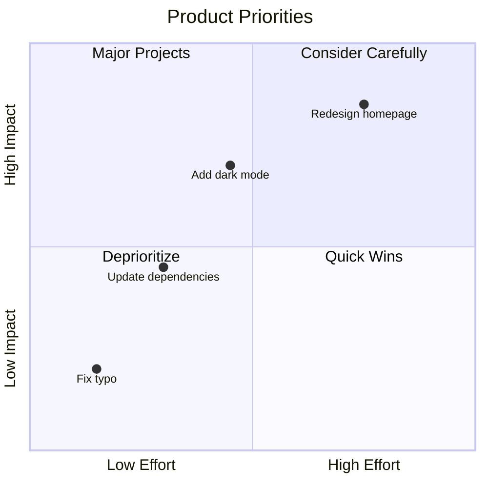


---

## 13. XY Chart (`xychart-beta`)

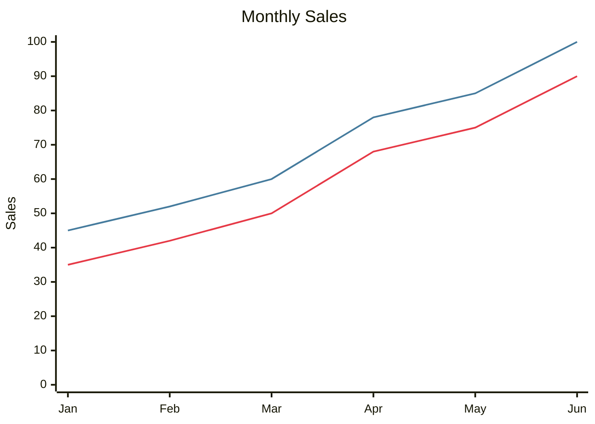

---

## 14. Block (`block-beta`)
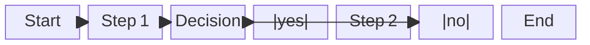

---

## 15. Sankey (`sankey-beta`)
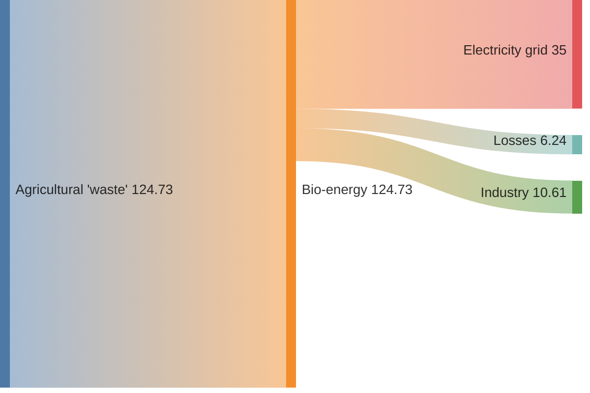

---

## 16. Packet (`packet-beta`)
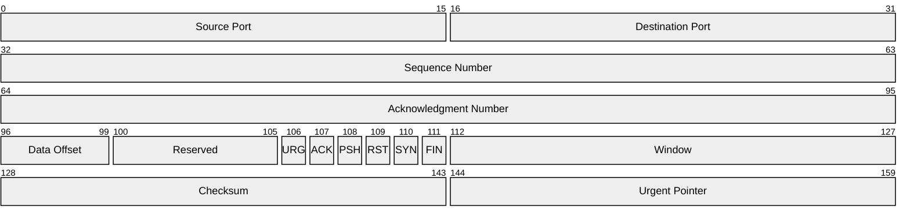

---

## 17. User Journey (`journey`)
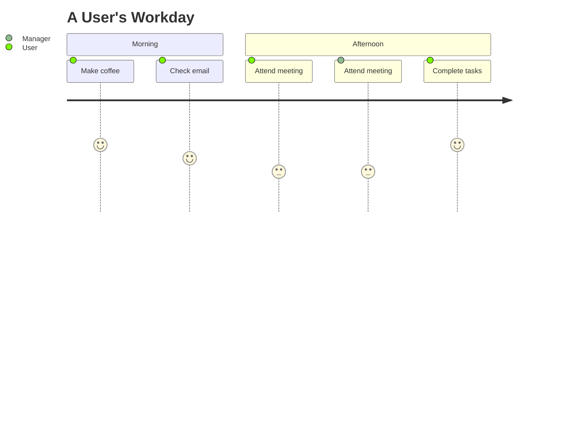

---

## 18. Requirement Diagram (`requirementDiagram`)
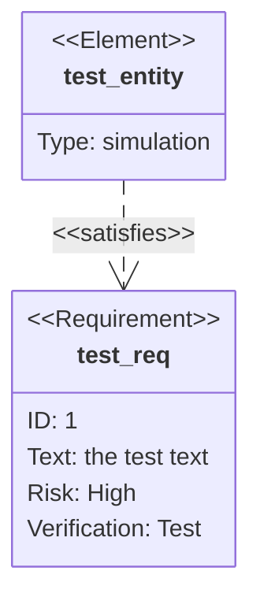

---

## 19. C4 Context Diagram (`C4Context`)
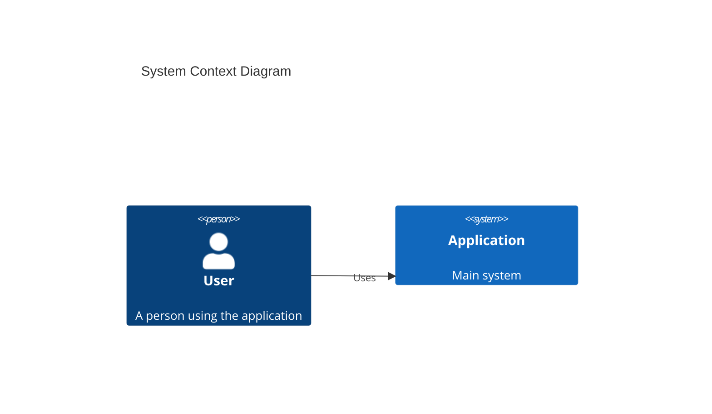

---

## 20. C4 Container Diagram (`C4Container`)
```mermaid
C4Container
    title Container Diagram
    Person(user, "User", "Application user")
    System_Boundary(app, "Application") {
        Container(web, "Web App", "JavaScript", "User interface")
        Container(api, "API", "Node.js", "Application services")
    }
    Rel(user, web, "Uses")
    Rel(web, api, "Calls")
```

---

## 21. C4 Component Diagram (`C4Component`)
```mermaid
C4Component
    title Component Diagram
    Container_Boundary(api, "API") {
        Component(auth, "Auth Component", "Service", "Handles authentication")
        Component(users, "User Component", "Service", "Manages users")
    }
    Rel(auth, users, "Authenticates")
```

---

## 22. C4 Dynamic Diagram (`C4Dynamic`)
```mermaid
C4Dynamic
    title Dynamic Diagram
    Person(user, "User", "Application user")
    Container(app, "Application", "Web app", "Main application")
    Rel(user, app, "1. Submits request")
    Rel(app, user, "2. Returns response")
```

---

## 23. C4 Deployment Diagram (`C4Deployment`)
```mermaid
C4Deployment
    title Deployment Diagram
    Deployment_Node(server, "Application Server", "Linux") {
        Container(app, "Application", "Node.js", "Main application")
    }
    Deployment_Node(database, "Database Server", "Linux") {
        ContainerDb(db, "Database", "PostgreSQL", "Stores application data")
    }
    Rel(app, db, "Reads and writes")
```

---

---

## 24. Kanban (`kanban`)
```mermaid
kanban
    Todo
        [Write documentation]
    In Progress
        [Build examples]
    Done
        [Choose diagram types]
```

---

## 25. Architecture (`architecture-beta`)
```mermaid
architecture-beta
    group app(cloud)[Application]
    service server(server)[Application Server] in app
    service db(database)[Database] in app
    server:R -- L:db
```

---

## 26. Radar Chart (`radar-beta`)
```mermaid
radar-beta
    title Team Skills
    axis Communication
    axis Design
    axis Coding
    axis Testing
    curve Team { 80, 70, 90, 75 }
```

---

## 27. Treemap (`treemap-beta`)
```mermaid
treemap-beta
    "Project"
        "Frontend"
            "Components": 40
            "Styles": 20
        "Backend"
            "API": 30
            "Database": 10
```

---

## 28. Venn Diagram (`venn-beta`)
```mermaid
venn-beta
    set A["Developers"] : 40
    set B["Designers"] : 30
    union A,B : 10
```

Feel free to adjust the contents or styling to suit your own documentation or presentation needs!