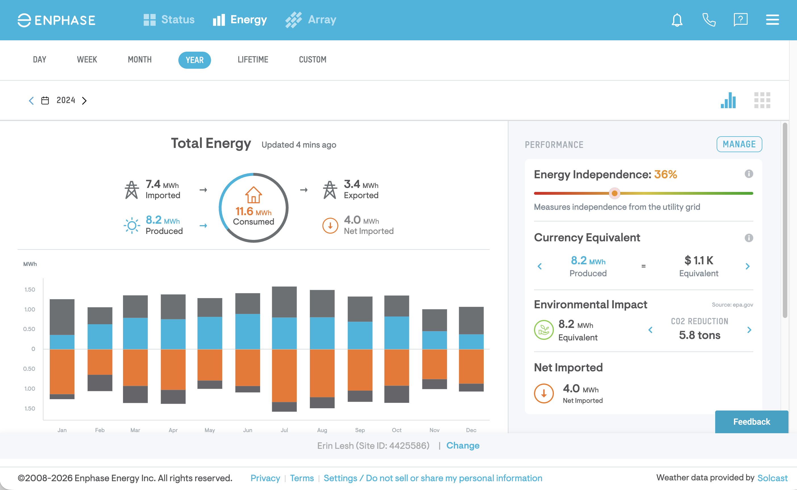

# Welcome to PurplePlatypus

Start typing your markdown here.

## Features

- **Live preview** as you type
- Open and save `.md` files
- Split pane editor

Get at [Glowing Cat Software](https://glowingcat.com)

|           | Col 1 | Col B | Col 3 |
| --------- | :---- | :---: | ----: |
| **Row 1** | 1     | 2     | 3     |
| **Row 2** | 4     | 5     | 6     |
| **Row B** | 7     | 8     | 9     |
| **Row 4** | 10    | 11    | 12    |





- apple
- pear
- orange

1. blue
1. red
1. green

- [x] Step 1
- [ ] Step 2
- [ ] Step 3

This is a Quote:
> Four score and seven years ago our fathers brought forth on this continent, a new nation, conceived in Liberty, and dedicated to the proposition that all men are created equal.

This is inline `code`.

```
For x = 1; x < 10; x++
	print(x)
```

This is ++inline++ equation: $E = mc^2$

$$
\sigma = \sqrt{\frac{1}{N} \sum_{i=1}^{N} (x_i - \mu)^2}
$$

# Hello 1
## Hello 2
### Hello 3
#### Hello 4
##### Hello 5
###### Hello 6

---

http://glowingcat.com[^1] 


[^1]: This is a footnote

---

**You**

🎨 Can you show me a picture of a kitty wearing pajamas?

🤒🥵🥶🤯🥳😎😥😱😡🤬💀👽🤖😺🙈🙉🙊😃😇🥰

---

**Assistant**

I can't create or display images — I'm text-only! But I can offer you this little ASCII kitty ready for bed:

```
      /\___/\
     (  o.o  )   z Z z
      >  ^  <
     /|  •  |\    ← pajama buttons!
    / |  •  | \
      |  •  |
     (___)(___)
```

If you'd like an actual picture, you could try:
- **AI image generators** like DALL-E, Midjourney, or Stable Diffusion — a prompt like "cute kitten wearing striped pajamas, cozy, soft lighting" would work great
- **A quick image search** for "cat in pajamas" — the internet has blessed us with many 🐱

---